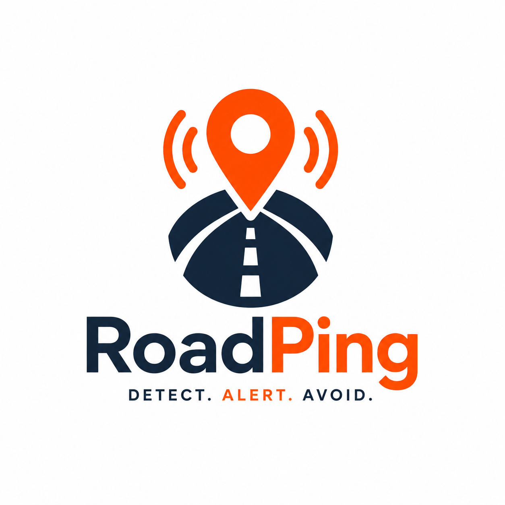

  

# RoadPing: Safe Road Ahead

**RoadPing** is a community-driven road safety application designed to eliminate the "invisible hazards" of driving. It provides real-time audio and visual alerts for potholes, road hazards, and speed breakers before you even see them.

---

## 💡 The "Why" Behind RoadPing
*The road is used by everyone. The least we can do is look out for each other.*

RoadPing isn't just an app; it's a community mission. We believe that every driver deserves a fair warning. No sudden mishaps, no avoidable accidents, and no expensive rim-bending surprises.

### Situations where RoadPing saves the day:

| | | |
|---|---|---|
|    | **🌧️ The Flooded Road** |  When it rains, every puddle looks identical. RoadPing knows if that puddle is a shallow splash or a rim-breaking pit because a fellow "Pinger" reported it earlier. |
|| **🚛 The Traffic Shadow** | Stuck behind a truck? You can't see the road ahead. RoadPing warns you before a hazard, giving you time to brake safely. |
|| **🌙 Night Driving** | Headlights only show so much. Our app alerts you to deep potholes in the dark before your brain even registers the danger. |
|| **❤️ Protect What Matters** | Whether it's your parents driving home or a kid on a scooter, every report you make is a "heads-up" that could prevent a tragedy. |

---

## Key Features

- **Precision Hazard Tracking**: High-precision tracking logic for instant alerts.
- **Background Protection**: Runs silently while you use navigation apps, providing voice alerts even when the screen is off.
- **Community Reporting**: Single-tap hazard reporting with photo evidence and GPS precision.
- **Jolt Sensitivity**: Automated detection that suggests reporting when your phone's accelerometer detects a hard impact.
- **Forever Free & Private**: No ads. No data selling. Your real-time location is never stored—only the hazards you report.

---

## How to Use

### 1. The Setup
- **Sign In**: Secure Google Auth login.
- **Permissions**: Grant "Always Allow" location access. This is required so the app can warn you while you use other apps.

### 2. Driving Mode
- Open the app and tap **"Start Protection"**.
- Minimize the app. RoadPing will continue to monitor your path in the background.
- When you approach a hazard, you will hear a **Voice Alert**: *"Caution: Pothole ahead."*

### 3. Reporting a Hazard
- If you see a new pothole or speed breaker, tap the **Large Orange Report Button**.
- (Optional) Snap a photo to help the community visualize the danger.
- The hazard is instantly synced to all nearby drivers.

---

## Legal & Privacy

We take your safety and data seriously. Please review our official documents:
- [Privacy Policy](privacy.html)
- [Terms and Conditions](terms.html)

---

## ☕ Support the Mission
RoadPing is a solo-developer project maintained for public safety. We have **zero revenue** and **zero ads**. If RoadPing saved your tires, consider buying us a "chai" to keep the servers running.

**UPI ID**: `semibit@idfcbank` 

---
*Made with ❤️ for safer roads.*
